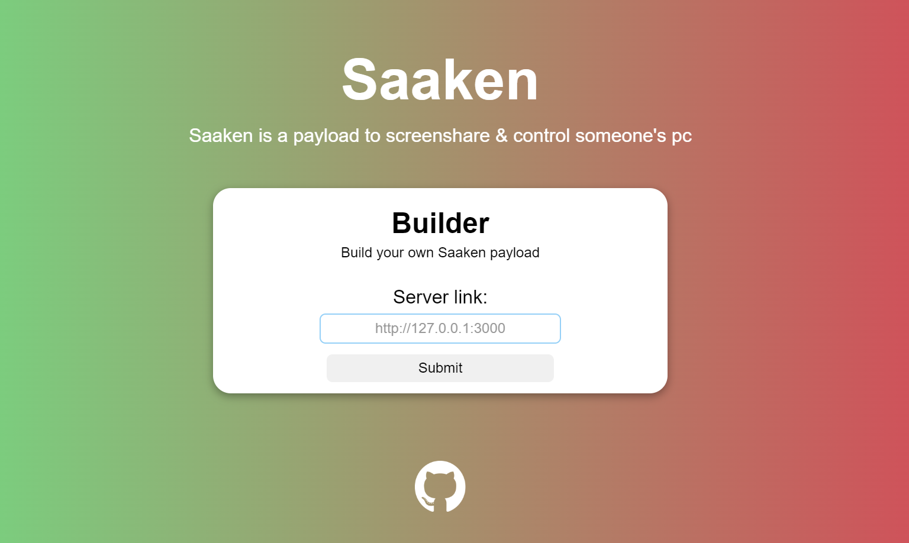

<h1 align="center">
   
  
   
</h1>

     
    <b>
    <h3>
        POC | Control someone's screen only with Python 
    </h3>
    </b>

# Introduction

Saaken is a POC (proof-of-concept) that it's possible to control someone's screen only using Python. 
The victim's payload connects to a web-server using socket which will transmit all the screen data to the client.
The client receives the screen data and print it in a window using pygame.
In addition to that, the client can click anywhere on the window, which will be transmitted by the server to the victim that will receive the position and automatically click on it.

# How to use

This tool is made for people who have a basic understanding of Python.
You have to start the server.py, which will be hosted on `http://127.0.0.1:3000` if not changed.  
The app.py is a flask web-server made for building the client to the attacker and the victim easier.
Once you built the payload for the victim and the client for the attacker. Execute the attacker client then execute the victim's one (the one that should be sent)

# Warning

This tool is explicitly made for cyber-security & research purposes.
It intends to show the power of a simple programming language, Python.
Do not use for malicious purposes & the creator is not responsible for your actions.